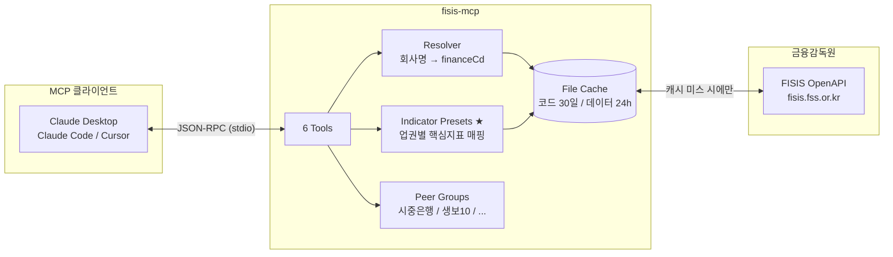
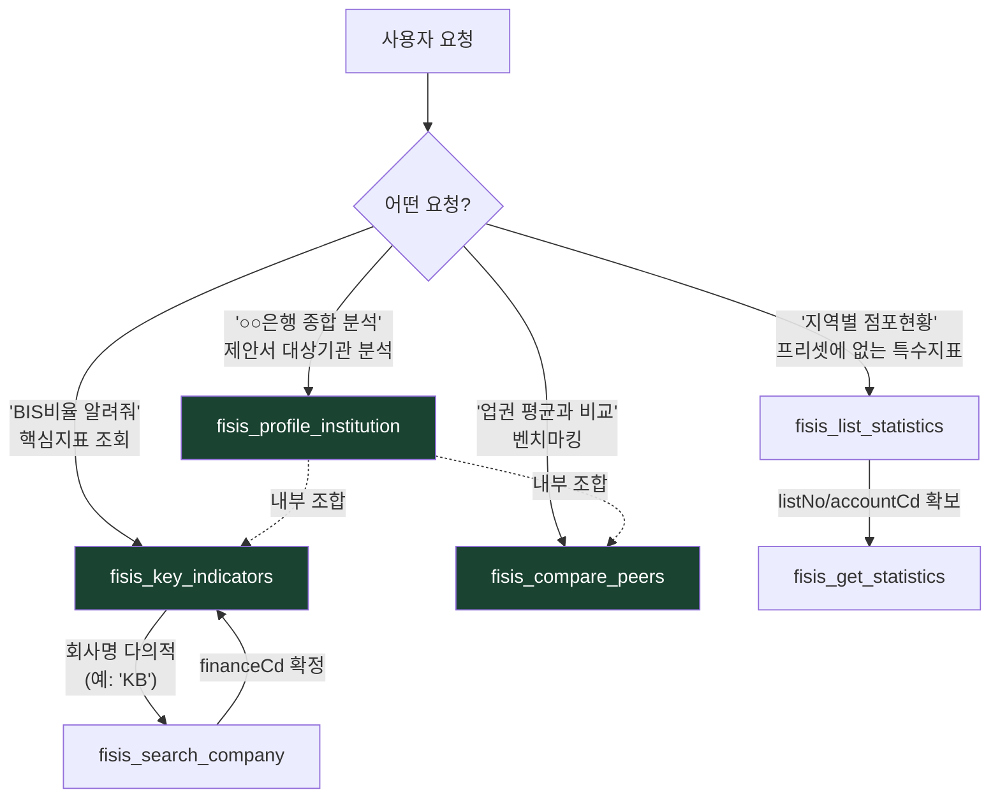
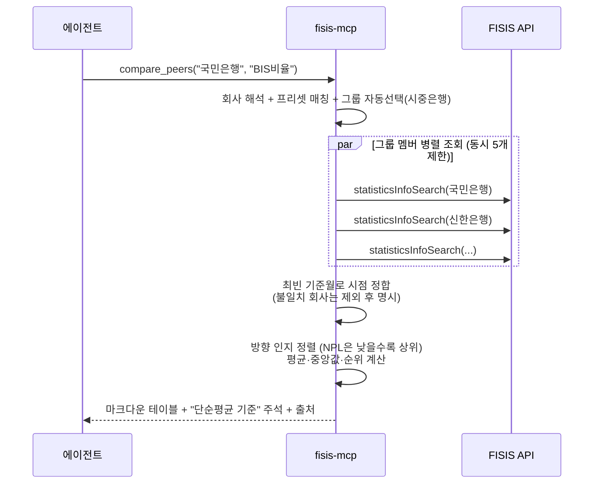

# fisis-mcp

> 금융감독원 **금융통계정보시스템(FISIS)** OpenAPI를 AI 에이전트에게 연결하는 MCP 서버

[](https://github.com/namojo/fisis-mcp/actions/workflows/ci.yml)
[](LICENSE)
[](package.json)

```
"국민은행 BIS비율을 시중은행 평균과 비교해줘"

→ ## BIS총자본비율 벤치마킹 (2026Q1, 시중은행)
   기준회사: 국민은행 17.55% — 그룹 내 2위/7사, 평균 대비 +0.43%p
   | 순위 | 회사 | 값(%) |
   |------|------|-------|
   | 1 | ... | ... |
   그룹 평균: 17.12% / 중앙값: 17.05%
   출처: 금융감독원 금융통계정보시스템(FISIS)
```

## 왜 FISIS인가?

DART가 "기업 한 곳의 속사정"이라면, FISIS는 **"업권 전체의 건강검진표"** 입니다.

| | DART | FISIS |
|---|------|-------|
| 데이터 성격 | 상장사 공시·재무제표 | 금융회사 업무보고서 기반 경영통계 |
| 커버리지 | 상장/공시대상 법인 | **비상장 포함** 전 금융회사 (은행·보험·증권·저축은행·카드) |
| 강점 | 개별 기업 심층 분석 | **업권 횡단 비교** — BIS, K-ICS, NPL, 연체율 등 감독지표 |
| MCP 생태계 | 다수 존재 | **이 프로젝트가 최초** |

"귀사의 BIS비율은 시중은행 평균 대비 X%p" 같은 벤치마킹 문장은 FISIS 없이는 만들 수 없습니다. 금융사업 제안서의 **대상기관 분석 → 시장 환경 → 경쟁 비교** 뼈대를 에이전트가 자율적으로 채우게 하는 것이 이 서버의 목적입니다.

## 아키텍처



핵심 설계 세 가지:

1. **정규화 응답** — 원시 JSON을 그대로 반환하지 않습니다. 단위·출처가 명기된 마크다운 테이블로 가공해 컨텍스트 토큰을 아낍니다.
2. **코드 매핑 흡수** — `회사명→financeCd`, `지표명→listNo/accountCd` 변환 같은 지저분한 부분을 전부 서버가 처리합니다. 에이전트는 "국민은행", "BIS비율" 같은 자연어에 가까운 인자만 넘깁니다.
3. **프리셋 = 도메인 자산** — "은행이면 BIS·NPL, 보험이면 K-ICS, 카드면 연체율"이라는 도메인 지식이 코드로 내장되어 있습니다 (`src/domain/indicator-presets.ts`).

## 빠른 시작

### 1. 인증키 발급 (무료, 5분)

[fisis.fss.or.kr/page/api-key.jsp](https://fisis.fss.or.kr/page/api-key.jsp) (또는 FISIS 홈 → **OPEN API** → **인증키신청** 메뉴)

> ⚠️ FISIS API는 **해외 IP를 차단**합니다. 한국 네트워크에서 사용하세요.

### 2. MCP 클라이언트 설정

**Claude Desktop** — `claude_desktop_config.json`:

```json
{
  "mcpServers": {
    "fisis": {
      "command": "npx",
      "args": ["-y", "fisis-mcp"],
      "env": { "FISIS_API_KEY": "발급받은키" }
    }
  }
}
```

**Claude Code** — 프로젝트 루트에서:

```bash
claude mcp add fisis -e FISIS_API_KEY=발급받은키 -- npx -y fisis-mcp
```

**소스에서 직접 실행**:

```bash
git clone https://github.com/namojo/fisis-mcp.git
cd fisis-mcp && npm install && npm run build
# MCP 설정의 command를 "node", args를 ["<경로>/dist/src/index.js"]로
```

### 3. 프리셋 실측 검증 (권장)

지표 프리셋은 최초에 **동적 탐색**(searchHints 키워드 매칭)으로 동작하지만, 실측 검증 후 코드를 하드코딩하면 조회가 훨씬 빨라집니다:

```bash
FISIS_API_KEY=발급키 npm run verify-presets
# 출력된 listNo/accountCd를 src/domain/indicator-presets.ts 에 반영 → verified: true
```

분기 1회 재실행을 권장합니다 (FISIS 통계표 개편 감지용).

## Tool 구성과 선택 흐름

6개 tool은 **상위(복합) → 하위(원자)** 계층으로 설계되어 있습니다. 에이전트가 아래 흐름대로 자율 선택합니다:



| Tool | 용도 | 언제 |
|------|------|------|
| `fisis_key_indicators` | 회사 1곳의 핵심지표 세트 (최근 N분기 + 추세) | ★ 1차 선택지 |
| `fisis_compare_peers` | 동종그룹 순위·평균·격차 | 벤치마킹 문장 근거 |
| `fisis_profile_institution` | 지표 + 벤치마킹 종합 (composite) | 제안서 대상기관 분석 |
| `fisis_search_company` | 회사명 → financeCd 해석 | 다의성 해소 |
| `fisis_list_statistics` | 613개 통계표·계정 탐색 | 프리셋 밖 특수지표 |
| `fisis_get_statistics` | 코드 직접 지정 원자 조회 | 탐색 후 정밀 조회 |

### 벤치마킹 동작 원리

`fisis_compare_peers` 내부 시퀀스입니다. 시점 정합(공표 시차로 회사마다 최신 분기가 다를 수 있음)이 핵심입니다:



## 내장 프리셋

| 권역 | 지표 |
|------|------|
| 은행 | BIS총자본비율, 고정이하여신비율(NPL), ROA, ROE, 예대율, 총자산, 당기순이익 |
| 생명보험 | **K-ICS비율** (2023~ / 이전 기간은 RBC 자동 폴백), 수입보험료, 13회차 유지율 |
| 손해보험 | K-ICS비율, 손해율 |
| 금융투자 | 순자본비율(NCR), 레버리지비율 |
| 저축은행 | BIS비율, 고정이하여신비율 |
| 여신전문 | 조정자기자본비율, 연체율 |

동종그룹: 시중은행 / 지방은행 / 인터넷전문은행 / 주요 생보 10사 / 주요 손보 10사 — `src/domain/peer-groups.ts`에서 편집 가능.

## 사용 예시 (프롬프트)

에이전트에게 이렇게 말하면 됩니다:

```
카카오뱅크 최근 4분기 핵심지표 보여줘
→ fisis_key_indicators 1회 호출

KDB생명 K-ICS비율을 주요 생보사와 비교해줘
→ fisis_compare_peers (top_life_insurers 그룹, 2023 이전 구간은 RBC 자동 분기)

○○저축은행에 제안서를 쓰려고 해. 대상기관 분석 섹션 초안 만들어줘
→ fisis_profile_institution + 에이전트의 문장 생성

저축은행 업권에서 업종별 기업대출금 통계 찾아줘
→ fisis_list_statistics(keyword='업종별') → fisis_get_statistics
```

## 환경변수

| 변수 | 기본값 | 설명 |
|------|--------|------|
| `FISIS_API_KEY` | (필수) | 인증키 |
| `FISIS_CACHE_DIR` | `~/.fisis-mcp` | 캐시 위치 |
| `FISIS_CACHE_TTL_HOURS` | 24 | 통계 데이터 캐시 (코드류는 30일 고정) |
| `FISIS_MAX_ROWS` | 60 | tool 응답 최대 행 수 (토큰 보호) |
| `FISIS_LANG` | kr | kr / en |

CLI 플래그 `--no-cache`로 캐시 우회.

## 트러블슈팅

| 증상 | 원인/해결 |
|------|-----------|
| "FISIS API 연결 실패 (타임아웃)" | 해외 IP 차단 — 한국 네트워크에서 실행. VPN/클라우드 리전 확인 |
| "인증키가 유효하지 않습니다" | 키 오타 또는 미승인 — fisis.fss.or.kr/page/api-key.jsp에서 상태 확인 |
| "해당 조건의 데이터가 없습니다" | **공표 시차** — FISIS는 분기 종료 후 2~3개월 뒤 공표. 기간을 한 분기 앞으로 |
| "프리셋 갱신 필요" 경고 | 통계표 개편 — `npm run verify-presets` 재실행 후 프리셋 갱신 |
| 특정 회사만 벤치마킹에서 제외됨 | 해당 사 미공표 또는 시점 불일치 — 응답 하단에 사유 명시됨 |
| 값이 FISIS 웹 화면과 다름 | 웹은 **가중평균**, 이 서버는 **단순평균** — 응답에 명시되어 있음 |

## 개발

```bash
npm run build           # tsc 빌드
npm test                # 12개 테스트 (네트워크 불필요 — mock FISIS 봉투로 파이프라인 검증)
npm run inspector       # MCP Inspector로 tool 수동 테스트
npm run verify-presets  # 프리셋 코드 실측 (API 키 + 한국 IP 필요)
```

기여 환영합니다. 특히:
- `verify-presets` 실행 결과로 프리셋 `verified: true` 전환 PR
- 동종그룹 추가 (대형증권사, 캐피탈사 등)
- 권역코드(partDiv/lrgDiv) 실측 보정

## 설계 노트 (왜 이렇게 만들었나)

- **파일 캐시, SQLite 아님** — `npx` 배포에서 네이티브 모듈(better-sqlite3)은 Node 버전별 바이너리 문제의 주범. zero-dependency 파일 캐시로 대체 (수백 항목 수준에선 성능 동일)
- **프리셋 2단 구조** — `verified` 프리셋은 즉시 조회, 미검증은 searchHints로 런타임 동적 탐색. 통계표 개편이 와도 서버가 죽지 않음
- **부분 실패 허용** — 지표 7개 중 1개 실패 시 6개는 정상 반환. composite tool에서 특히 중요
- **에러 = 다음 행동 안내** — 모든 에러는 에이전트가 재시도 전략을 세울 수 있는 문장으로 변환 ("기간을 한 분기 앞으로", "fisis_list_statistics로 탐색" 등)
- **stdout 순결성** — stdio transport에서 stdout은 JSON-RPC 채널. 모든 로그는 stderr

## 라이선스 / 출처

MIT © namojo

데이터 출처: [금융감독원 금융통계정보시스템](https://fisis.fss.or.kr). 모든 tool 응답에 출처가 자동 표기됩니다. FISIS 통계정보 이용 시 출처 명시 의무가 있습니다.
